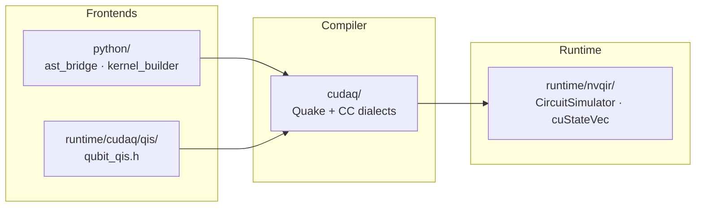

<div align="center">

# QUANTUM-CUDA

**Contribution work for [NVIDIA CUDA-Q](https://github.com/NVIDIA/cuda-quantum)** — analysis, numerical verification, and the patch behind an upstream documentation fix.

[](https://github.com/NVIDIA/cuda-quantum/pull/5459)
[](https://github.com/NVIDIA/cuda-quantum/issues/2141)
[](#verification)
[](verification/verify_gates.py)
[](LICENSE)

</div>

---

## Summary

CUDA-Q ships three quantum operations that user code can reach but the
documentation never mentions: `exp_pauli`, `givens_rotation` and
`fermionic_swap`. [Issue #2141](https://github.com/NVIDIA/cuda-quantum/issues/2141)
reports the gap and asks directly — *"in the first place, what is `givens`?"*

[**PR #5459**](https://github.com/NVIDIA/cuda-quantum/pull/5459) documents all
three. While pinning down the convention to document, it also turned up a sign
error in the doc comment on the simulator method that every backend overrides.

> [!NOTE]
> Nothing in the PR was transcribed from existing header comments. Every matrix
> and sign convention was recomputed from the gate sequences CUDA-Q actually
> executes. The script that does it is in [`verification/`](verification/) and
> runs in under a second.

## What's here

| Path | Contents |
| :--- | :--- |
| [`verification/verify_gates.py`](verification/verify_gates.py) | Standalone numerical check of every claim in the PR. Requires only `numpy`. |
| [`patches/`](patches/) | The upstream commit as a `git format-patch` export, DCO sign-off intact. |

## The bug

The doc comment on `CircuitSimulator::applyExpPauli` claimed the method applies
`exp(-i·θ·P)`. It does not.

The base implementation performs a basis change, a CNOT ladder, and then
`rz(-2.0 * theta)` on the ladder target. Since `rz(a) = exp(-i·a·Z/2)`,
substituting `a = -2θ` gives `exp(+i·θ·Z)` — so the operation as a whole applies
the **positive** convention.

Four other descriptions in the tree already said so:

| Location | States |
| :--- | :--- |
| `Optimizer/Dialect/Quake/QuakeOps.td` | `applies exp(i theta P)` |
| `runtime/cudaq/builder/kernel_builder.h` | `exp(i theta P)` |
| `python/cudaq/kernel/kernel_builder.py` | `exp(i theta P)` |
| `python/cudaq/qis/qis.py` | `exp(i theta P)` |
| **`runtime/nvqir/CircuitSimulator.h`** | **`exp(-i theta ...)`** ← the outlier |

It matters because `applyExpPauli` is the virtual method each simulator backend
overrides, so its comment is the description a backend author reads first. The
fix is comment-only; no behavior changes.

## Verification

```console
$ python3 verification/verify_gates.py
Givens matrix matches the exp_pauli pair:        True
Fermionic SWAP matrix matches the gate sequence: True
applyExpPauli decomposition == exp(+i theta P):  True
applyExpPauli decomposition == exp(-i theta P):  False
r1(x) == exp(i*x/2) * rz(x):                     True

All checks passed.
```

Lines three and four are the pair that caught the sign error — the decomposition
matches the positive convention and fails the negative one.

<details>
<summary><b>What each check does</b></summary>

<br>

1. **Givens** — rebuilds the matrix from the two `exp_pauli` calls in
   `runtime/cudaq/kernels/givens_rotation.h` and compares against the documented
   form.
2. **Fermionic SWAP** — replays the full eighteen-gate sequence from
   `runtime/cudaq/kernels/fermionic_swap.h`, global phase correction included.
3. **`exp_pauli` sign** — rebuilds the `applyExpPauli` decomposition and tests it
   against *both* conventions, so the result distinguishes them rather than
   merely confirming one.
4. **`r1` vs `rz`** — shows the two differ only by a global phase of
   `exp(i·x/2)`, which is why they are distinct gates despite identical verbal
   descriptions.

Matrix exponentials use the closed form `exp(i·t·P) = cos(t)·I + i·sin(t)·P`,
valid because a Pauli tensor product squares to the identity — so `scipy` is not
needed. Qubit ordering is big-endian (q0 most significant), matching the
convention CUDA-Q uses for multi-qubit operator matrices.

</details>

## The change

1. **`exp_pauli` section** added to the Quantum Operations reference page: the
   `exp(i·θ·P)` convention, the rule that Pauli characters map to target qubits
   in order — so word length must equal target count — and both supported call
   forms in Python and C++.
2. **`givens_rotation` and `fermionic_swap`** added to the Python API reference.
   Both are `PyKernel` methods, but neither appeared in the `automethod` list, so
   they never rendered at all. Their docstrings now carry the definition and
   unitary matrix of each rotation.
3. **The sign comment** on `applyExpPauli` corrected.

Four files, +72 / −5.

### Scope left to the maintainers

Two questions were raised on the issue rather than settled unilaterally:

- On the C++ side, `givens_rotation` and `fermionic_swap` live in
  `cudaq_internal::` under `runtime/cudaq/kernels/`, which `CppAPICodingStyle.md`
  designates as internal, and they are referenced only from
  `unittests/nvqpp/integration/gate_library_tester.cpp`. They were therefore not
  presented as public C++ operations.
- `cudaq.lib.givens` and `cudaq.lib.fermionic_swap` are reachable as
  `@cudaq.kernel` functions, but `cudaq.lib` is otherwise undocumented, so they
  were not promoted either.

## Repository analysis

Read of `NVIDIA/cuda-quantum` as of 2026-09-21, at release 0.16.0 — Apache-2.0,
primary language C++, ~1.1k stars, ~455 forks, pushed to daily.



| Area | Role |
| :--- | :--- |
| `cudaq/` | MLIR compiler. `QuakeOps.td` is the authoritative definition of each operation's semantics. |
| `runtime/nvqir/` | Simulator interface and the cuStateVec / cuTensorNet backends. |
| `runtime/cudaq/qis/` | C++ gate-level user API. |
| `python/cudaq/kernel/` | Python frontend — AST lowering to Quake, plus the dynamic builder. |
| `docs/sphinx/` | User documentation. `api/default_ops.rst` is the per-gate reference. |
| `unittests/`, `targettests/` | C++ unit tests and per-target integration tests. |

### Contribution requirements

- **DCO sign-off is mandatory** on every commit (`git commit -s`). The DCO app
  wants a sign-off per listed author, so an unsigned `Co-authored-by` trailer
  blocks a PR.
- **pre-commit runs in CI** — clang-format 22 (C++), yapf Google style (Python),
  markdownlint, pyspelling/aspell against a checked-in allowlist, plus
  license-header and Markdown link checks at the `pre-push` stage.
- Features and bug fixes are expected to **start from an issue**, so a maintainer
  can weigh in before code is written.

### Where a newcomer can start

All 13 open `good first issue` items are marked `stale-notified`. They split by
what hardware the work needs:

| Group | Issues | Needs |
| :--- | :--- | :--- |
| Build, simulator, noise models | `#1571` `#914` `#2584` `#1640` | CUDA GPU and a full build |
| Documentation and some testing | `#2141` `#2215` `#710` `#3103` | Nothing beyond a checkout |

Without local GPU access the second group is where work can be *verified* before
submitting rather than guessed at — which is what drove the choice here.

## Reproducing the patch

```bash
git clone https://github.com/NVIDIA/cuda-quantum.git
cd cuda-quantum
git am ../patches/0001-document-exp-pauli-givens-fermionic-swap.patch
```

The patch carries its original DCO sign-off.

## License

[Apache-2.0](LICENSE).

The analysis and `verification/verify_gates.py` are original work in this
repository, released under Apache-2.0. The patch under `patches/` is a diff
against [NVIDIA/cuda-quantum](https://github.com/NVIDIA/cuda-quantum), which is
itself Apache-2.0 — so the same terms carry across both, and the upstream notice
governs the upstream-derived content.
